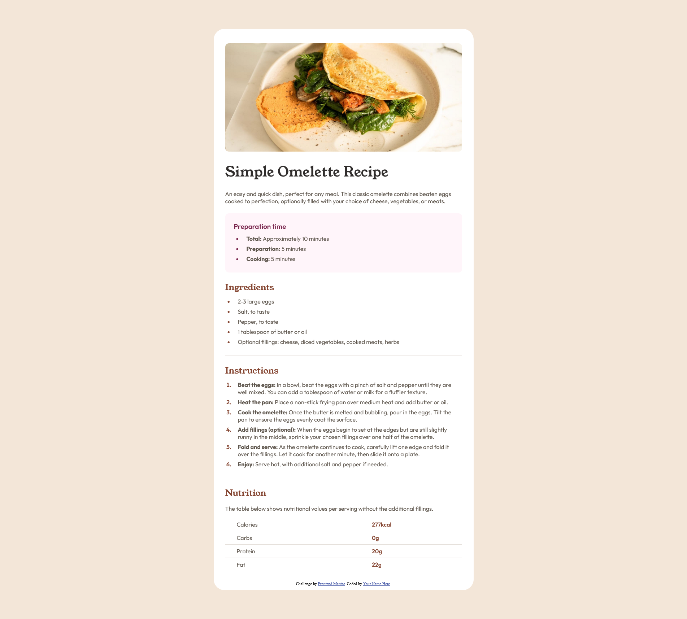
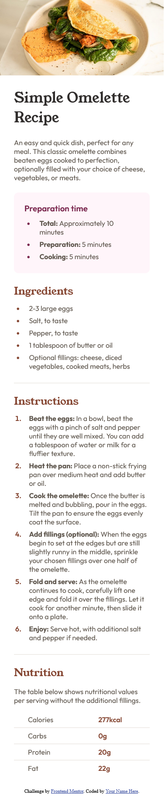

# Frontend Mentor - Recipe page solution

This is a solution to the [Recipe page challenge on Frontend Mentor](https://www.frontendmentor.io/challenges/recipe-page-KiTsR8QQKm). Frontend Mentor challenges help you improve your coding skills by building realistic projects.

## Table of contents

- [Overview](#overview)
  - [The challenge](#the-challenge)
  - [Screenshot](#screenshot)
  - [Links](#links)
- [My process](#my-process)
  - [Built with](#built-with)
  - [What I learned](#what-i-learned)
  - [Continued development](#continued-development)
  - [Useful resources](#useful-resources)
- [Author](#author)
- [Acknowledgments](#acknowledgments)

## Overview

### Screenshot




### Links

- Solution URL: [GitHub repository](https://github.com/danielkull/FrontM-recipe-page-main)
- Live Site URL: [Live site from GitHub](https://danielkull.github.io/FrontM-recipe-page-main/)

## My process

### Built with

- Semantic HTML5 markup
- CSS custom properties
- Flexbox
- Desktop-first workflow

### What I learned

- [Stackoverflow: Cannot select first child in css](https://stackoverflow.com/questions/48045740/cannot-select-first-child-in-css) - This helped me to understand the difference between `:first-child`and `:fist-of-type`.

In this html structure I wanted exclude in my css rule the first and the last section (aka `.recipe-section`class.). But the pseudo-class `:first-child` selects the first **child** of it's **parent**. In this case the **parent** of the **sections** is the **div** element. Thus the first child is the **header** element.

To select only the first child of the **sections**, I had to use `:first-of-type`, so that the pseudo class works only with elements of the same **type**. In this case the **section** elements.

```html
<div class="main-article_wrapper">
  <header class="recipe-intro"></header>
  <section class="recipe-section preparation-time"></section>
  <section class="recipe-section"></section>
  <section class="recipe-section"></section>
  <section class="recipe-section recipe-section--nutrition"></section>
</div>
```

```css
.recipe-section:not(:first-of-type):not(:last-of-type) {
  border-bottom: var(--light-grey) 1px solid;
}
```

### Continued development

- Add Navbar for recipes of different categories
  - Mobile (Hamburger)
- Add Slideshow (Carousel)
  - Mobile (with touch)
- Build it to a favorit recipe page
  - Save/Unsave your favorit recipe
    - Star Button
  - Build your one recipes
  - Look for a free recipe api and load it per REST API in your page

## Author

- GitHub Page - [Daniel Kull](https://github.com/danielkull)
- Frontend Mentor - [@danielkull](https://www.frontendmentor.io/profile/danielkull)

## Acknowledgments

My thanks goes again to the Coding-bootcamps-eu, it's teachers and fellow students. Also I want to give a big thank you to all people who create content/tuorials or examples for free.
